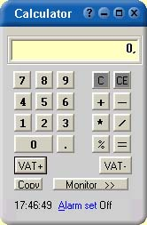



## ACalc Update

### Description

Updated version with lots of improvements. Designed so the user can handle almost everything through the numeric keyboard and of course you can operate the calulator by using the mause also. User can even change the look, color and functionality of the calculator.
 
### More Info
 

             |
---                |---
**Submitted On**   |2002-01-07 08:12:56
**By**             |[nalle](https://github.com/Planet-Source-Code/PSCIndex/blob/master/ByAuthor/nalle.md)
**Level**          |Intermediate
**User Rating**    |4.8 (38 globes from 8 users)
**Compatibility**  |VB 4\.0 \(32\-bit\), VB 5\.0, VB 6\.0
**Category**       |[Complete Applications](https://github.com/Planet-Source-Code/PSCIndex/blob/master/ByCategory/complete-applications__1-27.md)
**World**          |[Visual Basic](https://github.com/Planet-Source-Code/PSCIndex/blob/master/ByWorld/visual-basic.md)
**Archive File**   |[ACalc\_Upda47450192002\.zip](https://github.com/Planet-Source-Code/nalle-acalc-update__1-30624/archive/master.zip)

